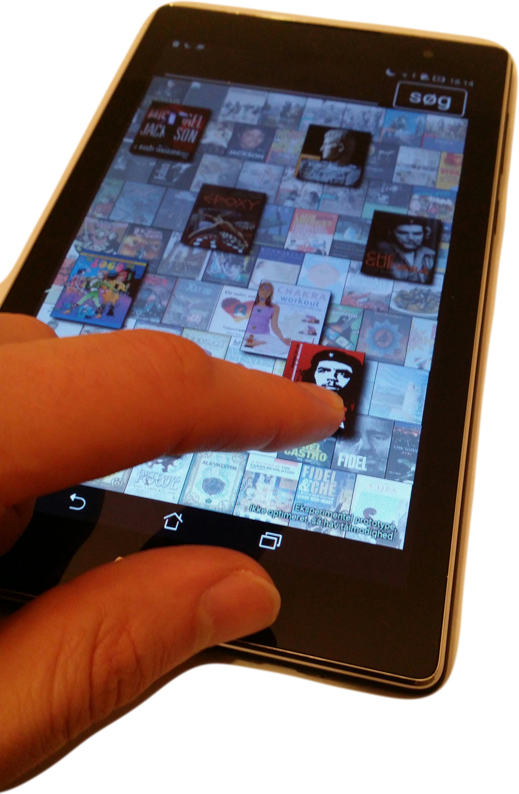
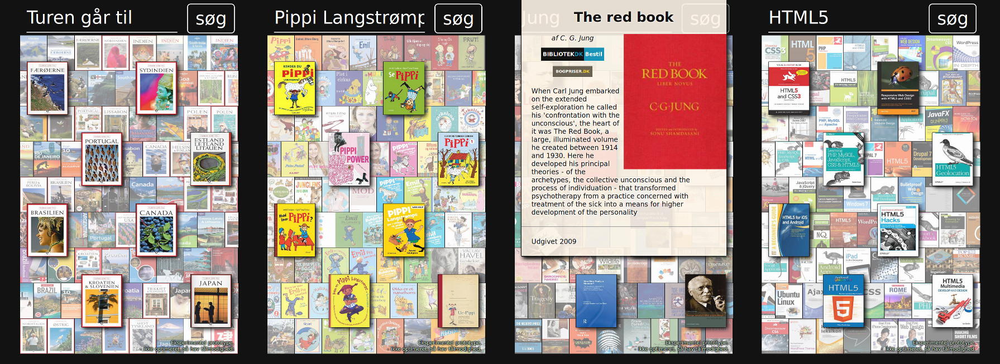

<!--
# BibApp
-->
<h1 style=clear:none>BibApp</h1><h2 style=clear:none>- inspirationsværktøj</h2>

BibApp er et inspirationsværktøj, der hjælper brugeren med at finde relaterede bøger. 
Princippet er, at bøgerne i forgrunden er grundlag for hvilke bøger, der bliver vist i baggrunden. 
En bog kan trækkes fra baggrund til forgrund, hvorefter nye bøger vil komme i baggrunden.

BibApp opfylder bedømmelseskriterierne:

- *Realiserbar:* kørende prototype er realiseret.
- *Værdiskabende for biblioteker og biblioteksbrugere:* den hjælper med at finde relaterede bøger, og inspirerer. Dette er et område, der mangler digitale redskaber.
- *Brugervenlig og visuelt appellerende:* interaktionen er designet til at være enkel og let at bruge, baseret på brugerfeedback. Kommentarer fra brugertest er: "den er cool", "Charmerende, lettilgængelig, overskuelig vej til informationer", "begejstringen over det visuelt flotte".
- *Bruger kulturdata:* bygger på DBCs bibliografiske data, ADHL-datasæt, samt bogforsider. Den beriger desuden ADHL-data med anbefalings&shy;service og eigenvektoranalyse.
- *Er på dansk:* ja.
- *Kan bruges efter konkurrencen:* Prototypen kan videreudvikles og distribueres: som mobil-app, som tablet-app, som applikation til touch-infoskærme, og som widget, der indlejres i DDB-CMS eller bibliotek.dk

 

De følgende sider vil går mere i detaljer med: 1) formål og kørende prototype, 2) grænseflade og interaktion, 3) datagrundlag og teknik, 4) videreudvikling.

<!-- 
# Formål og prototype  
-->

*Formålet er* at skabe et redskab til at gå på opdagelse i bibliotekets materialer:

- Ifølge bibliotekarer er der et uopfyldt behov for digitale inspirationsværktøj.
- Biblioteksbrugere melder ud, at de gerne vil finde lignende bøger, eksempelvis romaner inden for samme "genre".
- Konkret har jeg den personlige use-case, at jeg gerne vil finde gode bøger at læse højt for min søn.

*BibApp er implementeret*, og kommer automatisk med anbefalinger og inspiration, ud fra valgte bøger. Dette ses herover:

- "Turen går til..." inspirerer til "Lonely Planet" og lignende rejseguider
- "Pippi Langstrømpe" inspirerer til "Cirkeline", "Mumitroldende", "Alfons Åberg", "Emil fra Lønneberg", "Rasmus Klump", "Peter Pedal", "Babapappa", "Hodja fra Pjort",  og andre højtlæsningsbøger
- "HTML5" inspirerer udover CSS og webdesign også til mobiludvikling, Python, PHP og Drupal, etc.
- Visning af materialer indeholder beskrivelse, forside, og direkte link til bestilling og selve materialet på bibliotek.dk

*Prototypen kører direkte i webbrowsere*, og kan installeres som web-app på iPhone/Android/... ved at vælge "Add to Home Screen" / "Føj til hjemme&shy;skærm" eller tilsvarende. Den kan også pakkes ind som native app, hvilket foreløbigt er gjort for Android.

- Webapp: <a href=http://solsort.com/apps/bibapp/>solsort.com/apps/bibapp/</a>
- Android app(unsigned): <a href=http://solsort.com/apps/bibapp/bibapp.apk>solsort.com/apps/bibapp/bibapp.apk</a>

Det er en tidlig prototype, så den er kun designet til mobilt portrætformat, den er lidt langsom, den fungerer ikke på alle telefoner, og den afhænger af ikke-driftsparate webservices. Videreudvikling kan forbedre dette, så den vil kunne sættes i egentlig produktion.

# Interaktion og grænseflade

     
BibApp giver overblik med forsider, og klik på element viser overlay med materialevisning.

Her ser vi et klik på en bog i baggrunden, hvorefter mere info kommer frem.

    
Elementer kan trækkes fra baggrund til forgrund, hvorefter nye relaterede materialer fremkommer.

Her ser vi "Otto er et næsehorn" blive trukket fra baggrund til forgrund, hvorefter Hakkebakkeskoven, Gummi-Tarzan, etc., dukker op som nye anbefalinger i baggrunden.

Visningen gør stor brug af forsider, hvilket gør det visuelt inspirerende. 
Interaktionen er at trække i materialer, hvilket er naturligt på touch-devices.
Dette bygger på erfaringer fra "Visualisering af relationer"-DDB-CMS-widget.

Det nuværende layout er resultatet af brugerstudier og feedback på de første udgaver af prototypen.

# Data

Datakilder som er brugt under app-udviklingen er: 1) ADHL og biblio&shy;grafiske data fra DBCs hjemmeside. 2) Links til forsidebilleder fra bogpriser.dk.  3) JSONP-enabled DDB-CMS API ovenpå brønden via dev.vejlebib.dk.

De bibliografiske poster har jeg beriget med anbefalinger og en vektor, der kan bruges til afstandsmål mellem materialer. Begge dele er udregnet fra ADHL-datasættet:

*Anbefalingerne* svarer til ADHL-servicen tilføjet en vægtning, som korrigerer, således at populære materialer ikke bliver overrepræsenteret. Dette giver bedre og mere relevante resultater.

*Afstandsmål* mellem materialer skabes ved, at materialerne projiceres ind i det rum, som de (200) mest betydende ADHL-eigenvektorer udspænder. Det kan blandt andet bruges til: at finde materialer der ligger imellem andre materialer, at lave klyngeanalyse af materialer, og at bestemme placering af materialer ved visualisering. 
På grund af tidsbegrænsning anvender app'en ikke dette endnu, men det har spændende perspektiver.

# Teknik

Prototypen er udviklet i HTML5 ovenpå react/reagent/re-frame i ClojureScript. 
 `github.com/rasmuserik/solsort-util/blob/master/src/solsort/apps/bib.cljs`
  Databehandling bruger Python, Gensim og LevelDB. 
 `github.com/rasmuserik/bib-data`

  Søgemaskine og online database kører via ElasticSearch og CouchDB.
  Mobilapp via Apache Cordova. 
`github.com/rasmuserik/bibapp-cordova`

# Videreudvikling - næste trin

BibApp prototypen er kørende. 
Når der kommer lejlighed til at bygge videre på app'en og gøre den produktions&shy;klar, vil følgende gøre den endnu bedre:

<table style="width:100%; font-size: 1.3rem"><tr><td width=48% valign=top>

Autogenererede forsider ud fra metadata for de materialer, som ikke har forsider.

Bedre anbefalingerne baseret på flere forgrunds&shy;elementer, i stedet for kun det allernærmeste.
Eksempelvis ved at interpolere baggrunds&shy;elementernes koordinater i eigenvektor&shy;rummet og bruge disse til at finde biblioteksmaterialet. Dette forud&shy;sætter udvikling af webservice for søgning i eigen&shy;vektor&shy;rummet.

Performanceoptimering af app'en. Den nuværende udgave er uoptimeret, hvilket er mærkbart.

Produktionswebservices hos DBC, frem for diverse hacks. Dette kræver CORS-understøttelse og diverse andre forbedringer af webservices.

Udvidelse af afstandsmål mellem materialer til ikke kun at være baseret på ADHL. Eigenvektor&shy;analyse af metadata er naturligt at tilføje.

Flere brugerstudier, og videreudvikling af app ud fra disse.

</td><td width=4%>&nbsp;</td><td width=48% valign=top>

Layout for tablets, touch-storskærme og widgets. Løses bedst ved dynamisk udregnet layout.

Eventuelt indlejring som inspirations&shy;værktøj i bibliotek.dk og DDB-CMS.

Publicering på app-markeder for Android og iOS, samt evt. Windows Phone, Amazon, BlackBerry, og FirefoxOS.

Animationer i brugergrænsefladen vil gøre den endnu mere intuitiv: det vil gøre det tydeligere, at man kan trække elemen&shy;terne, og hvad der sker, når man søger, bytter om på forgrundselementer, etc.

Konfigurerbar anbefalings&shy;præcision.

Tilføj scrolling til materialevisning.

Mulighed for at gemme materialer.

Bulk-webservice for performance. Der er mange http-forespørgsler, hvilket er en flaskehals i performance. Dette kan forbedres med webservice, der giver info om flere elementer.

Tydeligere feedback ved søgning.

</tr></table>

 

BibApp har potentiale: både som app og indlejret i andre systemer.  
Jeg håber, at der er interesse for at få den i drift, og vil med glæde   videreudvikle den, hvis der er behov for dette,

 
RasmusErik Voel Jensen  
solsort.com

