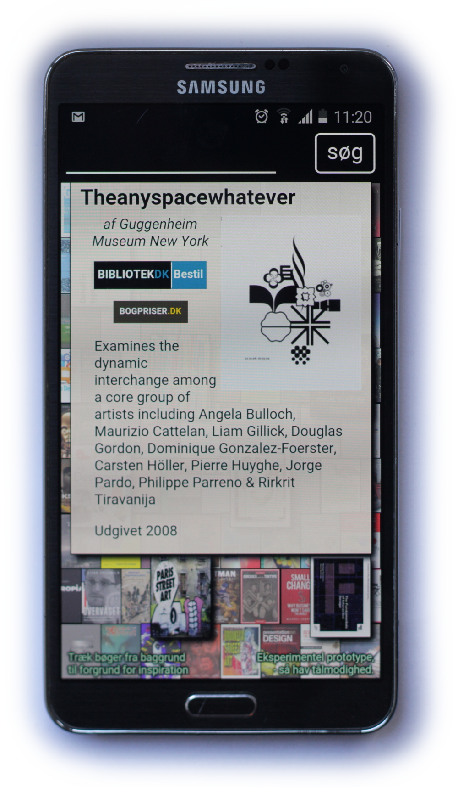
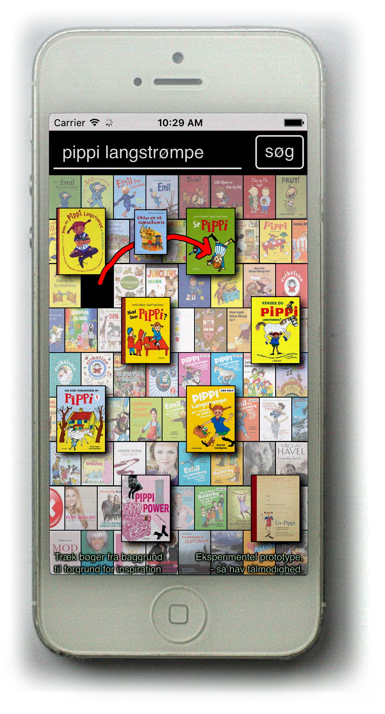
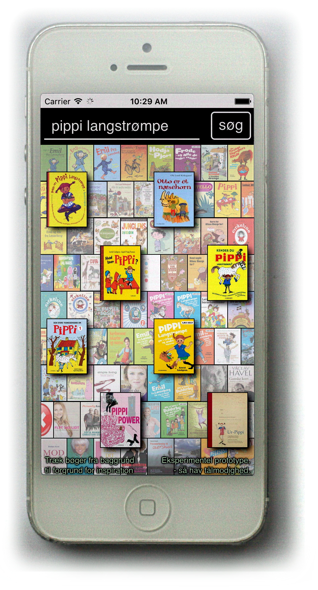

# BibApp Konkurrencebidrag
## Forside

BibApp - inspirationsværktøj
Projektbeskrivelse

BibApp er et inspirationsværktøj, der hjælper brugeren med at finde bøger der ligner.. 
Princippet er at man har nogle bøger i forgrunden, og disse er grundlaget for bøger vist i baggrunden. En bog kan trækkes fra baggrunden og erstatte en bog i forgrunden, - og derved finde nye bøger til baggrunden.

Den opfylder bedømmelseskriterierne:

- _Realiserbar:_ kørende prototype er realiseret
- _Værdiskabende for biblioteker og biblioteksbrugere:_ hjælper med at finde relaterede bøger, og inspirerer, hvilket et område hvor der mangler digitale redskaber.
- _Brugervenlig og visuelt appellerende:_ interaktionen er designet til at være enkel og let at bruge, baseret på brugerfeedback. Typiske kommentarer fra brugertest er: "den er cool", "Charmerende, lettilgængelig, overskuelig vej til informationer", "begejstringen over det visuelt flotte".
- _Bruger kulturdata:_ bygger på DBCs bibliografiske data, ADHL-datasæt, samt bogforsider. Den beriger desuden ADHL-data gennem anbefalingsservice og eigenvektoranalyse.
- _Er på dansk:_ ja.
- _Kan bruges efter konkurrencen:_ prototypen skal poleres før den er produktionsklar, men den er enkel at udvide så den udover at distribures som mobilapp, også kan optimeres til tablets og bibliotekernes touch-infoskærme, og indlejres som widget i DDB-CMS og bibliotek.dk

TODO De følgende afsnit går mere i dybden: 1) formål, og intro til kørende prototype. 2)

## Idé og prototype

Idéen er at skabe et redskab til at gå på opdagelse i bibliotekets materialer:

- Ifølge bibliotekarer er der et uopfyldt behov for digitale inspirationsværktøj.
- Biblioteksbrugere melder ud at det gerne vil finde lignende bøge, eksempelvis romaner inden for samme "genre".
- Konkret har jeg den personlige use-case, at jeg gerne vil finde gode bøger at læse højt for min søn.

Derfor har jeg en lavet app-prototype, der kommer med automatiske anbefalinger og inspiration, ud fra bøger som man udvælger. Dette kan ses herover, hvor:

- "Turen går til..." inspirerer til "Lonely Planet" og lignende rejseguider
- "Pippi Langstrømpe" inspirerer til "Cirkeline", "Mumitroldende", "Alfons Åberg", "Emil fra Lønneberg", "Rasmus Klump", "Peter Pedal", "Babapappa", "Hodja fra Pjort",  og andre højtlæsningsbøger
- "HTML5" inspirerer udover CSS og webdesign også til mobiludvikling, Python, PHP og Drupal, etc.
- Visning af materialer indeholder beskrivelse, forside, og direkte link til bestilling og selve materialet på bibliotek.dk

Prototypen er designet til mobiltelefon-format, og kan prøves i webbrowsere, installeres som app på Android-telefoner, - og som web-app på iPhone hvis du vælger "Add to Home Screen"/"Føj til hjemmeskærm". Da det er en tidlig prototype, er den langsom, virker ikke på alle modeller, og har stadig en del skønhedsfejl, men den grundlæggende interaktion og visualisering er implementeret.

- Webapp: http://solsort.com/apps/bibapp/
- Android app(unsigned): http://solsort.com/apps/bibapp/bibapp.apk

## Interaktion og grænseflade

 

Søgning give overblik over materialer, og når du klikker på et element vises overlay med materialeinfo.

 

Du kan trække elementer fra baggrund til forgrund, hvorefter der kommer nye relaterede materialer i baggrunden.

----

Idéen om at fokusere på visning af forsider, og at interaktionen foregår ved at trække bøgerne rundt på skærmen med touch, er inspireret af erfaringer/brugerfeedback i forbindelse med projektet "visualisering af relationer" ().

Materialevisningen, layout/placering af forsider, og vejledning omkring at trække bøger fra baggrund til forgrund, er resultat på brugerstudier med første udgave af prototypen.

## Næste trin

## Brugerfeedback

## Data

Prototypen - status / begrænsninger / brugerstudier / teknik

Datakilder - liste af datakilder, vægtning af anbefalinger, eigenvektoranalyse som afstandsmål

#

----

----

----

----

----

# Noter

Vægt:
- er realiserbar
- skaber værdi for biblioteker og/eller (eksisterende /potentielle) biblioteksbrugere
- er brugervenlig og visuelt appellerende
- bruger data fra kultur- og uddannelsesområdet
- er på dansk
- kan bruges af DBC efter endt konkurrence.

### Report content draft

Idéen om at trække bøger mellem forgrund og baggrund, er baseret på erfaringer fra tidligere projekte med visualisering af bibliotekmaterialer, hvor brugere med touch-devices netop ønskede at interagere med bøgerne ved at trække i dem.

Idéen er at skabe et redskab til at gå på opdagelse i bibliotekets materialer. Jeg hører fra bibliotekarer at der er et uopfyldt behov for digitale inspirationsværktøj. Som biblioteksbruger ønsker jeg selv at bruge det, - eksempelvis nu hvor jeg leder efter bøger at læse højt for min søn. Her vil en app en som anbefaler bøger ud fra dem man allerede kigger på, være et værdifuldt værktøj.

Et redskab som automatisk kan anbefale bøger ud fra hvad man allerede kigger på.
Et redskab som jeg selv kan bruge, eksempelvis nu hvor jeg leder efter en god bog at læse højt for min søn.

En årsag til at BibApp fokuserer på denne niche, er at jeg hører fra bibliotekarer, at der er et uopfyldt behov for digitale inspirationsværktøj.

Formålet er at skabe et værktøj til at inspirere og gå på opdagelse i bibliotekets materialer på mobiltelefonen.

Jeg sidder selv med den konkrete use-case at jeg vil finde gode bøger at læse højt for min søn. 

Derudover har jeg hørt fra bibliotekarer at der mangler digitale værktøj til inspiration.

Formålet er at skabe en ny måde for biblioteks brugere at gå på opdagelse i materialesamlingen på. At inspirere med relateret litteratur.
Samtaler med bibliotekarer har indikeret at der netop mangler værktøj til inspirationssegmentet.

Prototypen er udviklet til at blive brugt på telefoner, men kan let forestilles et bredere anvendelsesspektrum: storskærme med touch-support på bibliotekerne, så vel som indlejring i hjemmesider såsom DDB-CMS og bibliotek.dk

Konkret er det et værktøj, som jeg også selv vil bruge, - eksempelvis når jeg vil finde bøger at læse højt for min søn, kan jeg allerede nu se at jeg har gavn af den.

Illustrationen herunder demonstrerer hvordan den inspirere: da jeg søger efter Pippi Langstrømpe, inspirerer den mig til Cirkeline, Emil fra Lønneberg, Mumi-troldende, og Alfons Åberg. På lignende vis vil en søgning efter "Turen går til ...", dukker Lonely Planet, og andre rejseguider op, - og hvis man søger efter HTML5, kommer der inspiration, både i retning af kode(JavaScript,Python,PHP,Drupal...), design(CSS,Tegning,...) og derudover også indhold/strategi. 

- Beskrivelse
- Indhold

På de næste side går mere i detaljer med følgende indhold:

*Formålet* 

*Brugsoplevelsen* er designet til at være så brugsvenlig, og visuelt appelerende som muligt. Usability tests har givet god feedback, som er brugt til at forbedre prototype, - og derudover har brugerne været begejstrede for app'en, og interaktionen er intuitiv for de fleste.

*Datasættet* som er grundlaget for applikationen er ADHL-biblioteks-brugeradfærdsdata. 
Dette er videre raffineret til en anbefalingsservice, i første omgang via heuristisk model, og derefter via eigenvektoranalyse.  Udover ADHL-datasættet til at finde relaterede materialer, bruger applikationen også bibliografiske data, samt forsider.

*Teknisk* set er løsningen realiserbar og skalérbar. Prototypen demonstrerer grundidéen. 
*Perspektivet* er at når den er udviklet færdig, kan den bruges af DBC og bibliotekerne på mange måder: 1) biblioteksbrugere downloaded den som app eller i browser, 2) bibliotekerne kan anvende den til at gøre deres touch/info-skærme mere interaktive og 3) Bibliotek.dk og DDB-CMS kan indlejre den som en komponent.

----

Status: jeg har implementeret en prototype, som ligger som en webapp på http://solsort.com/apps/bibapp/ og som en android-app på http://solsort.com/apps/bibapp.apk Da den er implementeret i HTML5 vil den også kunne indpakkes som app på iPhone etc., samt indlejres i andre sites.

- Konklusion

Formål og værdi

Brugsoplevelse

Erfaringer fra tidligere udvikling af biblioteks-touch-widget er at brugere finde det naturligt at trække og interagere direkte med bogforsiderne. 

Datagrundlaget for App'en er: ADHL-datadumpet, bibliografiske data fra DBCs Databrønd, samt links til forsideillustrationer.

I forbindelse med udvikling af prototypen, har jeg sat forskellige services op oven på data:

- Søgemaskine, der kun retunerer materialer som har forsider
- Anbefalingsservice, der kommer med anbefalinger i stil med ADHL, men med en vægtninger der giver mere relevante resulatater.
- Afstandsmål mellem materialer (eigenvektoranalyse af lån), der kan bruges til klynger, materialer mellem materialer etc.
- Bibliografiske data der kan tilgås fra webapp, såvel som semantisk opmarkeret html.
- Info om hvilke materialer der har forsider

----

Den nuværende prototype bruger endnu ikke afstandsmålet (kunne ikke nå det pga. deadline), men det vil kunne forbedre app'en betydeligt da den så vil inspire med bøger der ligger _imellem_ de materialer som brugeren trækker rundt, frem for nu hvor den blot kommer med anbefalinger fra nærmeste materiale.

Kildekoden til databehandlingen ligger på github:rasmuserik/bib-data 
Teknisk anvender prototypen elasticsearch og couchdb, til at få data op hurtigt. 

Perspektivet er at det udover at være inspirationsværktøj på mobiltelefon og tablet - også kan være interessant på storskærme med touch på det fysiske bibliotek, og ligeledes som en inspirationskomponent til DDB-CMS og bibliotek.dk

[idéen er at vise nogle biblioteksmaterialer på skærmen, hvor brugeren kan udvælge nogle af dem, hvorefter de øvrige viste relaterer sig til disse.
i løbet af den forgangne måned har jeg fået en proof-of-concept prototype op at køre, som kan ses i webbrowsere (gerne på mobil) på http://solsort.com/apps/bibapp, og installeres på android fra http://solsort.com/app/bibapp/bibapp.apk (installation på android kræver at man har slået installation uden om Google-Play til, da jeg ikke har publiceret den endnu)]

----

Højtlæsning use case som en rød tråd

